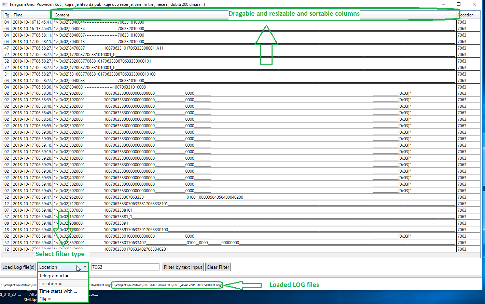

# telegramFunelerVerNext
Telegram funeler - posvecen Koci
Najnovija verzija - posvecena Mirku iz Kg.
1. Load some LOG files for MPAL/APAL FMC
2. Try some filters - there are four useful 
3. Columns are draggable
4. Rows can be sorted

Filter your LOG files as you never did before!

